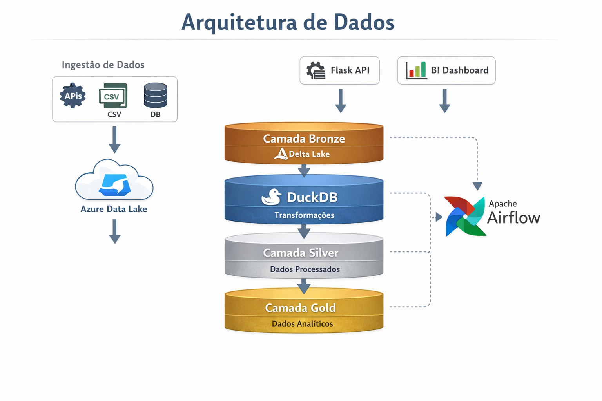

# Lakehouse Pipeline

Projeto de engenharia de dados ponta a ponta implementando **arquitetura medallion** sobre o Azure Data Lake Storage Gen2, orquestrado pelo Apache Airflow e executado com DuckDB + Delta Lake.

---

## Arquitetura

<p align="center">
      
</p>

```
Arquivos CSV (bike_store/)
        │
        ▼
  [ Landing ]  →  Azure ADLS (container raw)
        │
        ▼
  [ Bronze ]   →  Delta Lake (validado, particionado)
        │
        ▼
  [ Silver ]   →  Delta Lake (limpo, deduplicado, merge incremental)
        │
        ▼
  [ Gold ]     →  Delta Lake (star schema: dimensões + fact_sales)
        │
        ▼
  [ Analytics ]→  Delta Lake (KPIs agregados)
```

Cada camada é uma task independente no Airflow, permitindo reprocessamento granular e observabilidade isolada.

---

## Stack Tecnológica

|     Componente     |                  Tecnologia                 |
|--------------------|---------------------------------------------|
| Orquestração       | Apache Airflow 2.9.0 (CeleryExecutor)       |
| Armazenamento      | Azure Data Lake Storage Gen2                |
| Formato de tabela  | Delta Lake                                  |
| Engine de consulta | DuckDB                                      |
| Transporte colunar | PyArrow                                     |
| Paralelismo        | `concurrent.futures.ThreadPoolExecutor`     |
| Infraestrutura     | Docker Compose (Postgres + Redis + Airflow) |
| Linguagem          | Python 3.10+                                |

---

## Estrutura do Projeto

```
src/
├── config/
│   ├── settings.py          # Configurações via variáveis de ambiente com validação
│   └── queries/
│       ├── aggregate.py     # Templates SQL da camada analytics
│       └── gold.py          # Templates SQL da camada gold
├── pipeline/
│   ├── ingest_landing.py    # Upload de CSVs para a landing zone no ADLS
│   ├── ingest_bronze.py     # Validação de qualidade → Delta bronze
│   ├── ingest_silver.py     # Merge incremental → Delta silver
│   ├── ingest_gold.py       # Star schema → Delta gold (dimensões em paralelo)
│   └── run_analytics.py     # KPIs agregados → Delta analytics
├── helpers/
│   └── delta_writer.py      # Helpers de escrita e merge Delta
└── utils/
    ├── azure.py             # Factory de clientes ADLS
    ├── connection.py        # Context manager de conexão DuckDB
    ├── logger.py            # Logging estruturado
    └── schema/
        └── schema_registry.json  # Fonte única de verdade para todos os schemas
airflow/
└── dags/
    └── lakehouse_pipeline.py     # Definição do DAG
```

---

## Schema Registry

Todos os schemas de tabelas, chaves primárias, colunas de partição, regras de qualidade de dados e colunas derivadas são declarados em [`src/utils/schema/schema_registry.json`](src/utils/schema/schema_registry.json). As camadas do pipeline leem esse registry em tempo de execução — nenhum schema está hardcoded nas queries.

---

## Como Executar

### Pré-requisitos

- Docker Desktop
- Python 3.10+
- `uv` instalado (recomendado)
- Conta Azure Storage com ADLS Gen2 habilitado
- Arquivo `.env` na raiz do projeto

### Instalação de Dependências

Fluxo recomendado (usa `pyproject.toml` + `uv.lock`):

```bash
uv sync
```

Alternativa com `pip`:

```bash
python -m venv .venv
.venv/Scripts/activate
pip install -e .
```

### Variáveis de Ambiente

```env
AZURE_STORAGE_ACCOUNT_NAME=<conta>
AZURE_STORAGE_ACCESS_KEY=<chave_base64>
AZURE_CONNECTION_STRING=<connection_string>
ENDPOINT=https://<conta>.dfs.core.windows.net
LANDING_CONTAINER=<container>
BRONZE_CONTAINER=<container>
SILVER_CONTAINER=<container>
GOLD_CONTAINER=<container>
LOCAL_PATH=<caminho_absoluto_para_pasta_bike_store>
ROOT=<prefixo_raiz_delta>
```

### Iniciar o ambiente

```bash
docker compose up -d
```

Acesse a UI do Airflow em `http://localhost:8080` (credenciais padrão: `airflow / airflow`).

### Executar uma camada manualmente

```bash
# Exemplo: executar a camada gold localmente
python -c "from src.pipeline.ingest_gold import ingest_gold; ingest_gold()"
```

---

## Camadas do Pipeline

### Landing
Varre o `LOCAL_PATH` em busca de arquivos CSV e os envia para o container landing no ADLS, preservando a estrutura de diretórios.

### Bronze
Lê os CSVs da landing zone via DuckDB, aplica as regras de qualidade de dados do schema registry e grava tabelas Delta particionadas. As tabelas são processadas em paralelo com `ThreadPoolExecutor`.

### Silver
Realiza merge incremental do bronze para o silver com controle por watermark e hash MD5 por linha para deduplicação. Aplica limpeza de varchar (remoção de acentos, normalização de NULLs) e casting de tipos conforme o schema.

### Gold
Constrói um star schema a partir dos dados silver:
- `dim_date` — dimensão de datas (sequencial, âncora de dependência)
- `dim_customers`, `dim_products`, `dim_stores`, `dim_staffs` — processadas em paralelo
- `fact_sales` — tabela fato de itens de pedido com colunas derivadas orientadas pelo schema registry (`days_to_ship`, `is_late`, `sla_met`, entre outras), injetadas dinamicamente na query

### Analytics
Executa queries de agregação sobre a camada gold e grava os resultados como tabelas Delta com modo overwrite, prontas para consumo em ferramentas de BI.
